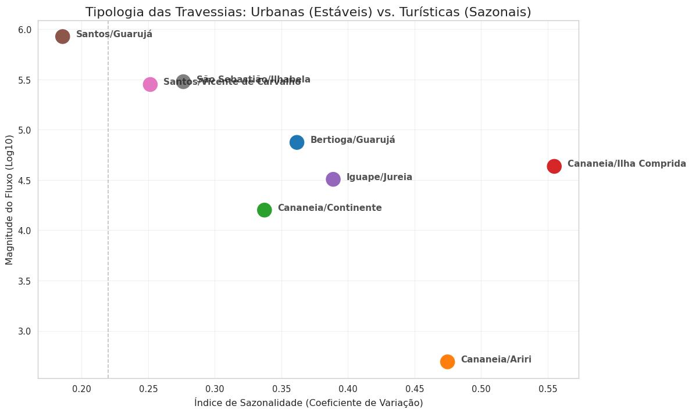

# 🚢 Entre o Porto e a Cidade: Análise de Mobilidade Santos-Guarujá


Este repositório contém os dados, códigos e o artigo final de um estudo de Ciência de Dados aplicado à mobilidade urbana no litoral paulista. O projeto investiga a **Travessia de Balsas Santos-Guarujá** entre 2019 e 2025, utilizando modelagem estatística para entender como a Pandemia de COVID-19 e a economia do Porto influenciam (ou não) o fluxo de veículos.

## 📄 Resumo do Projeto

A travessia Santos-Guarujá é um gargalo logístico crítico. A hipótese inicial deste estudo era de que o aumento das importações no Porto de Santos geraria um aumento proporcional no trânsito da balsa.

Utilizando dados públicos (Dados Abertos SP: SEMIL e Seade), aplicamos uma abordagem híbrida:
1.  **XGBoost (Machine Learning):** Para medir a importância das variáveis.
2.  **PyMC (Inferência Bayesiana):** Para decompor a série temporal e quantificar a incerteza dos impactos.


### 🔍 Principais Descobertas
*   **Desacoplamento:** O modelo provou que a atividade econômica do Porto tem correlação fraca/nula com o fluxo da balsa, sugerindo que a travessia atende a uma demanda urbana saturada, enquanto a carga pesada usa outras rotas.
*   **Tendência Secular Negativa:** Isolando o efeito da pandemia, a travessia apresenta uma tendência de queda no longo prazo (infraestrutura saturada ou mudança de hábitos).
*   **Impacto da Pandemia:** Foi quantificado como uma retração de quase 1 desvio-padrão completo, sendo o maior choque estrutural da série.

## 📂 Fontes de Dados

Este projeto foi possível graças a dados abertos de duas fontes governamentais:

1.  **Fluxo das Travessias (SEMIL)**
    *   **Fonte:** Secretaria de Meio Ambiente, Infraestrutura e Logística do Estado de São Paulo.
    *   **Descrição:** Volume mensal de veículos, pedestres e ciclistas transportados no Sistema de Travessias Litorâneas.
    *   **Link:** [Dados Abertos SP](https://dadosabertos.sp.gov.br/dataset/volume-trav-lit)

2.  **Comércio Exterior (Fundação Seade / MDIC)**
    *   **Fonte:** Dados do MDIC/Siscomex, consolidados e disponibilizados pela Fundação Seade.
    *   **Descrição:** Valor FOB mensal das importações para os municípios de Santos e Guarujá.
    *   **Link:** [Repositório Seade](https://repositorio.seade.gov.br/dataset/comercio-exterior)


## 📂 Estrutura do Repositório

```text
.
├── assets/
│   ├── tipologia_das_travessias.png
│   ├── decomposição_estrutural_e_ajuste.png
│   └── ...
├── analysis.ipynb
├── README.md
├── main.tex
├── artigo.pdf
└── requirements.txt
```

## 🛠️ Tecnologias e Métodos

*   **Linguagem:** Python
*   **Bibliotecas:**
    *   `pandas` & `numpy`: Manipulação de dados e Engenharia de Atributos (Sazonalidade via Fourier).
    *   `scikit-learn`: Gradient Boosting (XGBoost) para seleção de features.
    *   `pymc` & `arviz`: Modelagem Probabilística (Regressão Linear Bayesiana com Verossimilhança Student-t).
    *   `seaborn` & `matplotlib`: Visualização de dados.

## 🚀 Como Reproduzir
A maneira mais fácil de executar o código é diretamente no seu navegador através do Google Colab.

[](https://colab.research.google.com/github/neocrz/porto-cidade-mobilidade-analysis/blob/main/analysis.ipynb)

Alternativamente, para uma instalação local:

1.  Clone o repositório:
    ```bash
    git clone https://github.com/neocrz/porto-cidade-mobilidade-analysis.git
    ```
2.  Instale as dependências:
    ```bash
    pip install -r requirements.txt
    ```
3.  Execute o notebook `analysis.ipynb`. O script baixa automaticamente os dados atualizados das fontes governamentais relativo ao fluxo das travessias (dados relativos ao comércio exterior devem ser baixados externamente através do [Repositório Seade](https://repositorio.seade.gov.br/dataset/comercio-exterior)).

## 📊 Visualizações Chave

| Tipologia das Travessias | Decomposição Bayesiana |
|:-------------------------:|:-------------------------:|
|  |  |
| *Santos-Guarujá como outlier urbano* | *Tendência, Sazonalidade e Incerteza* |

## ✍️ Autor

**Fernando Gomes Cruz**
*   Ciência de Dados - FATEC Rubens Lara
*   [LinkedIn](https://www.linkedin.com/in/fegcruz/)

---
*Este projeto foi desenvolvido como parte de atividades acadêmicas e visa demonstrar a aplicação de métodos estatísticos avançados em problemas reais de políticas públicas.*
