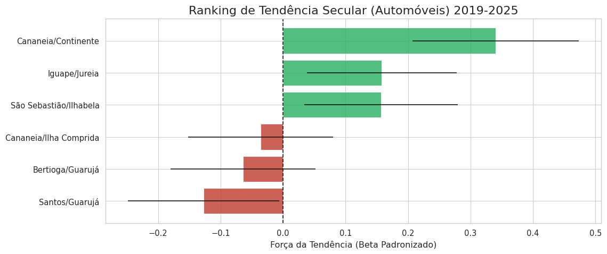
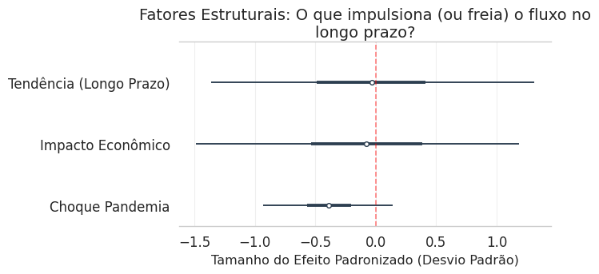

# 🚢 Porto Global, Mobilidade Local: O Desacoplamento da Demanda na Travessia Santos-Guarujá


Este repositório contém os dados, códigos e o artigo final de um estudo de Ciência de Dados sobre a mobilidade urbana no litoral paulista. O projeto investiga a **Travessia de Balsas Santos-Guarujá** entre 2019 e 2025, utilizando modelagem estatística para entender como a Pandemia de COVID-19 e a economia do Porto influenciam o fluxo de **automóveis**.

## 📄 Resumo do Projeto

A travessia Santos-Guarujá é um gargalo logístico crítico. A hipótese inicial deste estudo era de que o aumento da atividade econômica no Porto de Santos (importações) geraria um aumento proporcional no trânsito da balsa.

Utilizando dados públicos (Dados Abertos SP: SEMIL e Seade), aplicamos uma abordagem híbrida:
1.  **XGBoost (Machine Learning):** Para medir a importância relativa das variáveis.
2.  **PyMC (Inferência Bayesiana):** Para decompor a série temporal e quantificar a incerteza dos impactos estruturais.

### 🔍 Principais Descobertas
*   **Desacoplamento Econômico:** O modelo provou que a atividade do Porto tem correlação estatisticamente nula com o fluxo de automóveis. A travessia atende a uma demanda urbana já saturada, enquanto o tráfego de cargas utiliza outras rotas.
*   **Retração Estrutural:** A travessia Santos-Guarujá apresentou a **pior tendência secular** (crescimento negativo) entre todas as travessias do estado, indicando um sistema estagnado ou perdendo usuários.
*   **Impacto da Pandemia:** Foi quantificado como uma retração de quase 1 desvio-padrão completo no fluxo, sendo o choque estrutural mais significativo da série histórica.

## 📂 Fontes de Dados

Este projeto foi possível graças a dados abertos de duas fontes governamentais:

1.  **Fluxo das Travessias (SEMIL)**
    *   **Fonte:** Secretaria de Meio Ambiente, Infraestrutura e Logística do Estado de São Paulo.
    *   **Descrição:** Volume mensal de veículos, pedestres e ciclistas transportados no Sistema de Travessias Litorâneas.
    *   **Link:** [Dados Abertos SP](https://dadosabertos.sp.gov.br/dataset/volume-trav-lit)

2.  **Comércio Exterior (Fundação Seade / MDIC)**
    *   **Fonte:** Dados do MDIC/Siscomex, consolidados e disponibilizados pela Fundação Seade.
    *   **Descrição:** Valor FOB mensal das importações para os municípios de Santos e Guarujá.
    *   **Link:** [Repositório Seade](https://repositorio.seade.gov.br/dataset/comercio-exterior)

## 📂 Estrutura do Repositório

```text
.
├── assets/
│   ├── fig1_tipologia.png
│   ├── fig2_ranking.png
│   ├── fig3_xgboost.png
│   ├── fig4_fatores.png
│   ├── fig5_sazonal.png
│   └── fig6_projecao.png
├── analysis.ipynb
├── README.md
├── artigo_final.tex
├── artigo_final.pdf
└── requirements.txt
```
# 🛠️ Tecnologias e Métodos

*   **Linguagem:** Python
*   **Bibliotecas:**
    *   `pandas` & `numpy`: Manipulação de dados.
    *   `scikit-learn`: Gradient Boosting (XGBoost) para seleção de features.
    *   `pymc` & `arviz`: Modelagem Probabilística (Regressão Estrutural Bayesiana).
    *   `seaborn` & `matplotlib`: Visualização de dados.
*   **Modelagem de Sazonalidade:** Efeitos Fixos Mensais (Sazonalidade Discreta).

## 🚀 Como Reproduzir
A maneira mais fácil de executar o código é diretamente no seu navegador através do Google Colab.

[](https://colab.research.google.com/github/neocrz/porto-cidade-mobilidade-analysis/blob/main/analysis.ipynb)

Alternativamente, para uma instalação local:

1.  Clone o repositório:
    ```bash
    git clone https://github.com/neocrz/porto-cidade-mobilidade-analysis.git
    ```
2.  Instale as dependências:
    ```bash
    pip install -r requirements.txt
    ```
3.  Execute o notebook `analysis.ipynb`. O script baixa automaticamente os dados de fluxo das travessias. Os dados de comércio exterior devem ser baixados externamente do [Repositório Seade](https://repositorio.seade.gov.br/dataset/comercio-exterior).

## 📊 Visualizações Chave

| Ranking de Tendência Secular | Fatores Estruturais (Bayesiano) |
|:------------------------------:|:--------------------------------:|
|  |  |
| *Santos-Guarujá com a pior tendência do estado.* | *Impacto econômico nulo e tendência negativa.* |

## ✍️ Autor

**Fernando Gomes Cruz**
*   Ciência de Dados - FATEC Rubens Lara
*   [LinkedIn](https://www.linkedin.com/in/fegcruz/)

---
*Este projeto foi desenvolvido como parte de atividades acadêmicas e visa demonstrar a aplicação de métodos estatísticos avançados em problemas reais de políticas públicas.*
